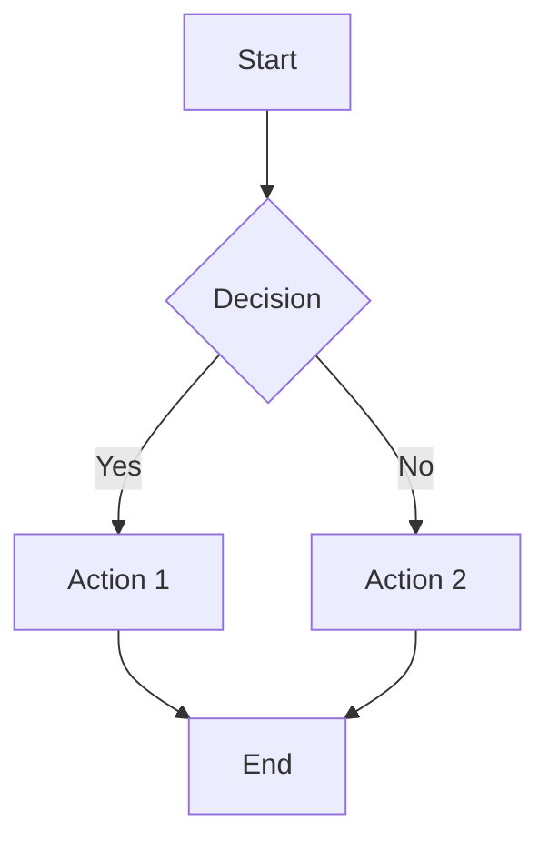
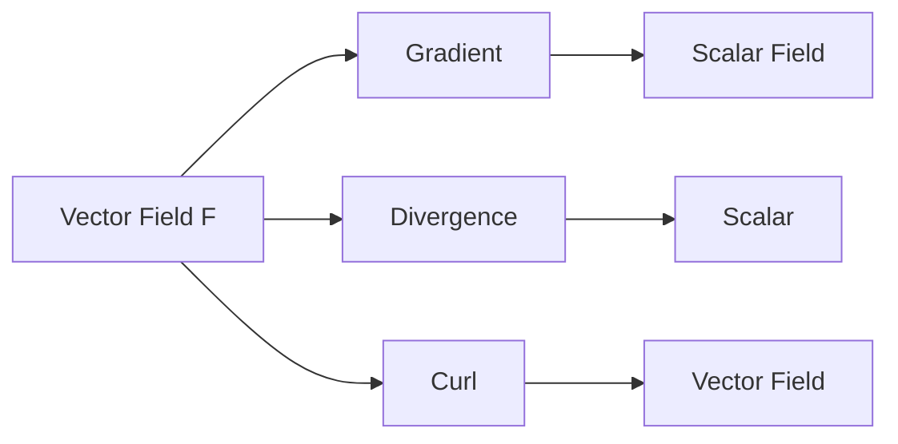
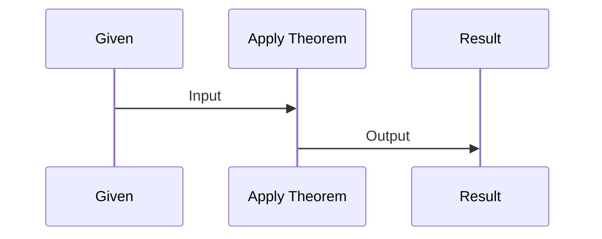
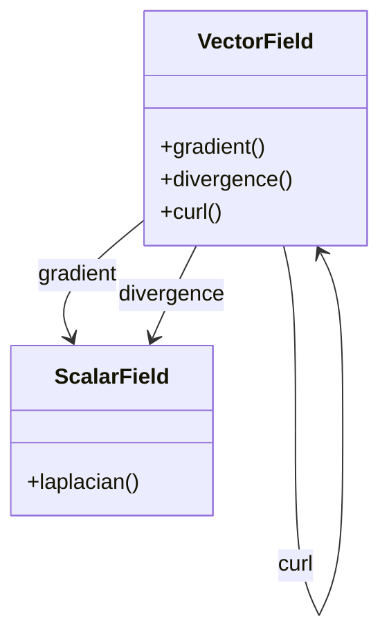
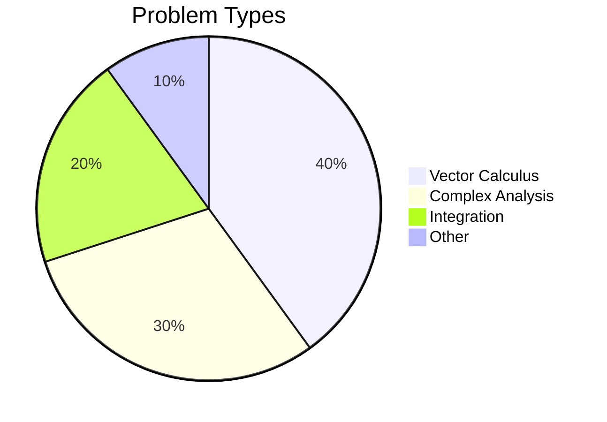
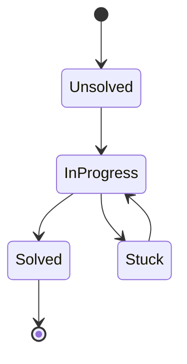
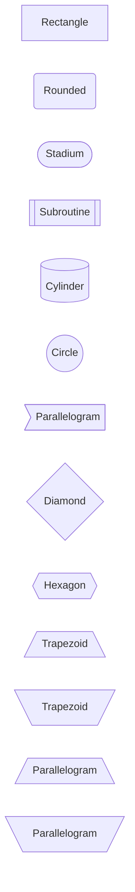

# Graph Examples: Mermaid, FunctionPlot & JuliaPlots

This file contains working examples for:
- **Mermaid** (diagrams and flowcharts)
- **FunctionPlot** (2D mathematical graphs)
- **JuliaPlots** (2D and 3D mathematical graphs using Julia)

All examples work in Obsidian.

---

## Mermaid Examples

Mermaid is great for flowcharts, diagrams, and graph theory. **Note**: Mermaid cannot plot continuous mathematical functions.

### Basic Flowchart



### Mathematical Flow Diagram



### Sequence Diagram (for Mathematical Proofs)



### Class Diagram (for Mathematical Structures)



### Gantt Chart (for Problem-Solving Steps)

```mermaid
gantt
    title Problem Solving Steps
    dateFormat X
    axisFormat %s
    section Step 1
    Understand Problem :0, 1
    section Step 2
    Set Up Equations :1, 2
    section Step 3
    Solve :2, 3
    section Step 4
    Verify :3, 4
```



### Pie Chart (for Distribution)



### State Diagram (for Problem States)



### XY Chart (Discrete Data Points Only)

**Note**: Mermaid can only plot discrete data points, not continuous functions.

```mermaid
xychart-beta
    title "Approximation of y = x² (discrete points)"
    x-axis [-2, -1, 0, 1, 2]
    y-axis [0, 1, 2, 3, 4]
    line [4, 1, 0, 1, 4]
```

### Node Shapes Reference



### Styling


---

## FunctionPlot Examples

FunctionPlot is a 2D mathematical function plotting plugin for Obsidian. **Important**: 
- FunctionPlot only supports **2D graphs**. It does **NOT** support 3D graphs or vector fields.
- **You must use function names** like `f(x)=x^2`, not just `x^2`. Always define functions with names.

### Basic Function Plot

```functionplot
---
title: Parabola
xLabel: x
yLabel: y
bounds: [-3, 3, -1, 5]
grid: true
---
f(x)=x^2
```

### Multiple Functions

```functionplot
---
title: Multiple Functions
xLabel: x
yLabel: y
bounds: [-5, 5, -2, 10]
grid: true
---
f(x)=x^2
g(x)=x^3
h(x)=sin(x)
i(x)=cos(x)
```

### Logarithmic Functions

```functionplot
---
title: Logarithmic Functions
xLabel: x
yLabel: y
bounds: [0, 10, -5, 5]
grid: true
---
f(x)=log(x)
g(x)=log(x)*2
h(x)=E+log(x)*2
```

### Trigonometric Functions

```functionplot
---
title: Trigonometric Functions
xLabel: x
yLabel: y
bounds: [-2*PI, 2*PI, -2, 2]
grid: true
---
f(x)=sin(x)
g(x)=cos(x)
h(x)=tan(x)
```

### Exponential Functions

```functionplot
---
title: Exponential Functions
xLabel: x
yLabel: y
bounds: [-3, 3, 0, 10]
grid: true
---
g(x)=E^x
f(x)=2^x
h(x)=x^E
```

### Custom Functions with Variables

```functionplot
---
title: Custom Functions
xLabel: x
yLabel: y
bounds: [0, 10, 0, 50]
grid: true
---
g(x)=x^PI
f(x)=E+log(x)*2
```

### Advanced Configuration

```functionplot
---
title: Advanced Graph
xLabel: Time (s)
yLabel: Velocity (m/s)
bounds: [0, 10, 0, 50]
grid: true
disableZoom: false
---
f(x)=x^2
g(x)=2*x+5
```

### Piecewise Functions

```functionplot
---
title: Piecewise Function
xLabel: x
yLabel: y
bounds: [-5, 5, -5, 5]
grid: true
---
f(x)=x < 0 ? -x : x
```

### Scatter Points

```functionplot
---
title: Function with Scatter Points
xLabel: x
yLabel: y
bounds: [-5, 5, -5, 25]
grid: true
---
f(x)=x^2
scatter: [[-2, 4], [-1, 1], [0, 0], [1, 1], [2, 4]]
```

---

## JuliaPlots Examples

JuliaPlots uses the Julia programming language to create mathematical graphs. **Note**: Requires Julia to be installed on your system.

### Basic Function Plot (Simple Syntax)

```juliaplots
f(x) = x^2

xmin = -5
xmax = 5
num_points = 100

title = Parabola
x_label = x
y_label = y

line_width = 2
dark_mode = false
```

### Multiple Functions

```juliaplots
f(x) = x^2, red
g(x) = x^3, blue
h(x) = sin(x), green

xmin = -5
xmax = 5
num_points = 100

title = Multiple Functions
x_label = x
y_label = y

line_width = 2
dark_mode = false
```

### Function with Scatter Points

```juliaplots
f(x) = x^2, red
scatter = 2,1 ; 3,2, blue, point1

xmin = -10
xmax = 25
num_points = 100

title = My Graph
x_label = time (s)
y_label = velocity (m/s)

color = rgb(0,255,0)
scatter_color = black
line_width = 2
dark_mode = false
```

### Advanced Customization

```juliaplots
f(x) = x^2, red
myfunction2(x) = cos(x), blue

xmin = -10
xmax = 10
num_points = 200

title = Advanced Graph
x_label = Time (s)
y_label = Velocity (m/s)

color = rgb(0,255,0)
scatter_color = black
line_width = 3
dark_mode = false
```

### Full Julia Code Syntax

You can also use full Julia code with the `julia` code block:

```julia
using Plots

f(x) = x^2
plot(f, -5, 5, label="y = x²", xlabel="x", ylabel="y", title="Parabola")
```

### Multiple Functions (Full Julia Syntax)

```julia
using Plots

f(x) = x^2
g(x) = x^3
plot(f, -5, 5, label="y = x²", xlabel="x", ylabel="y", title="Multiple Functions")
plot!(g, -5, 5, label="y = x³")
```

### 3D Plot (Full Julia Syntax)

```julia
using Plots

f(x, y) = sin(sqrt(x^2 + y^2))
plot3d(f, -5, 5, -5, 5, xlabel="x", ylabel="y", zlabel="z", title="3D Surface")
```

---

## Limitations

### FunctionPlot Limitations

- ✅ **2D functions only** - Supports $y = f(x)$ functions
- ❌ **No parametric plots** - Cannot plot parametric equations
- ❌ **No polar plots** - Cannot plot polar coordinates
- ❌ **No 3D graphs** - Cannot plot 3D surfaces or 3D functions
- ❌ **No vector fields** - Cannot visualize vector fields $\vec{F}(x,y)$
- ✅ **Multiple functions** - Can plot multiple functions on the same graph
- ✅ **Customizable** - Supports titles, labels, bounds, grid, zoom
- ✅ **Scatter points** - Can add scatter points to graphs

### Mermaid Limitations

- ✅ **Diagrams and flowcharts** - Excellent for these
- ✅ **Discrete data points** - Can plot using `xychart-beta`
- ❌ **No continuous functions** - Cannot plot $y = x^2$ directly
- ✅ **Graph theory** - Great for nodes and edges

### JuliaPlots Limitations

- ✅ **2D and 3D graphs** - Supports both 2D and 3D plotting
- ✅ **Multiple functions** - Can plot multiple functions on same graph
- ✅ **Scatter points** - Can add scatter points
- ✅ **Highly customizable** - Full control over appearance
- ❌ **Requires Julia** - Must have Julia installed on your system
- ❌ **Requires Plots.jl** - Must install Plots.jl package in Julia

---

## For Advanced Graphs (3D, Vector Fields)

### Using JuliaPlots (Recommended if Julia is installed)

JuliaPlots supports **3D graphs** using the full Julia syntax. See examples above.

### Alternative: External Tools

If you don't have Julia installed, use these alternatives:

1. **Create externally** (Desmos, Python/matplotlib, SageMath, MATLAB)
2. **Export as image** (PNG/SVG)
3. **Embed in markdown**: ``

### Recommended Tools for Advanced Graphs

- **3D Graphs**: JuliaPlots (if Julia installed), Desmos 3D, Python (matplotlib), SageMath, MATLAB
- **Vector Fields**: Python (matplotlib, quiver plots), SageMath, MATLAB, online vector field plotters

---

## Installation

### Mermaid
- Works natively in Obsidian (no installation needed)
- For VSCode: Install "Markdown Preview Mermaid Support" extension

### FunctionPlot
1. Open Obsidian Settings (⚙️)
2. Go to **Community Plugins**
3. Disable **Safe Mode** (if needed)
4. Click **Browse**
5. Search for **"Function Plot"** or **"Plot Vectors and Graphs"**
6. Click **Install** then **Enable**

### JuliaPlots
1. **Install Julia** from [julialang.org](https://julialang.org/downloads/)
2. **Add Julia to PATH** (Important!):
   - **Linux**: Usually done automatically, but if not:
     - Add Julia bin directory to PATH in `~/.bashrc` or `~/.zshrc`:
       ```bash
       export PATH="$PATH:/path/to/julia/bin"
       ```
     - Or create a symlink: `sudo ln -s /path/to/julia/bin/julia /usr/local/bin/julia`
   - **Windows**: 
     - Check "Add Julia to PATH" during installation
     - Or manually add `C:\Users\YourName\AppData\Local\Programs\Julia-1.x.x\bin` to PATH
   - **macOS**: 
     - Usually installed to `/Applications/Julia-1.x.app/Contents/Resources/julia/bin`
     - Add to PATH in `~/.zshrc` or `~/.bash_profile`
3. **Verify Julia is accessible:**
   - Open terminal/command prompt
   - Type `julia --version` - should show Julia version
   - If not found, Julia is not on your PATH
4. **Install Plots.jl** in Julia:
   - Open Julia REPL (type `julia` in terminal)
   - Type `]` to enter package manager
   - Type `add Plots` and press Enter
   - Type `backspace` to exit package manager
5. **Install JuliaPlots Plugin in Obsidian:**
   - Open Obsidian Settings (⚙️)
   - Go to **Community Plugins**
   - Disable **Safe Mode** (if needed)
   - Click **Browse**
   - Search for **"JuliaPlots"**
   - Click **Install** then **Enable**
6. **Configure Julia Path in Plugin Settings:**
   - Go to **JuliaPlots** plugin settings
   - Set the **Julia executable path** if auto-detection fails
   - On Linux/macOS: Usually `/usr/local/bin/julia` or `/path/to/julia/bin/julia`
   - On Windows: Usually `C:\Users\YourName\AppData\Local\Programs\Julia-1.x.x\bin\julia.exe`

### Troubleshooting JuliaPlots

**Error: "Julia could not be initialized. spawn julia ENOENT"**

This means Julia is not found on your PATH. Solutions:

1. **Find Julia installation:**
   - Linux: Usually in `/usr/local/bin/julia` or `~/julia/bin/julia`
   - Windows: Usually in `C:\Users\YourName\AppData\Local\Programs\Julia-1.x.x\bin\julia.exe`
   - macOS: Usually in `/Applications/Julia-1.x.app/Contents/Resources/julia/bin/julia`

2. **Add to PATH or configure plugin:**
   - **Option A**: Add Julia to system PATH (see installation steps above)
   - **Option B**: In JuliaPlots plugin settings, manually set the Julia executable path

3. **Test in terminal:**
   ```bash
   julia --version
   ```
   If this works, Julia is on PATH. If not, you need to add it.

4. **Restart Obsidian** after making PATH changes

**Error: "Unzip package compatibility issues" or "Failed to precompile"**

If you're using Julia 1.14-DEV (development version), you may encounter compatibility issues with the Unzip package (a dependency of Plots). Solutions:

1. **Use a stable Julia version** (recommended):
   - Download Julia 1.9 or 1.10 from [julialang.org](https://julialang.org/downloads/)
   - This avoids compatibility issues with development versions

2. **Try anyway**: Sometimes the Obsidian plugin handles errors differently - test if plots still work despite the error

3. **Wait for package updates**: Development versions may have breaking changes that packages haven't adapted to yet
