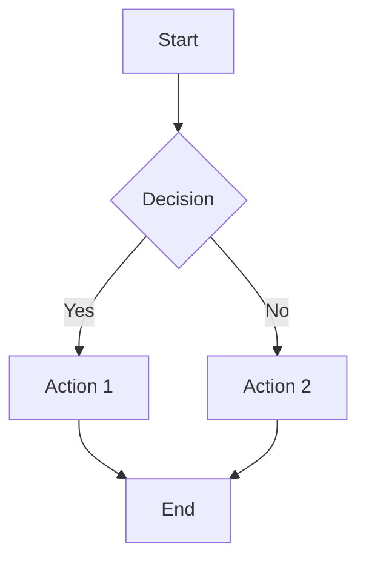
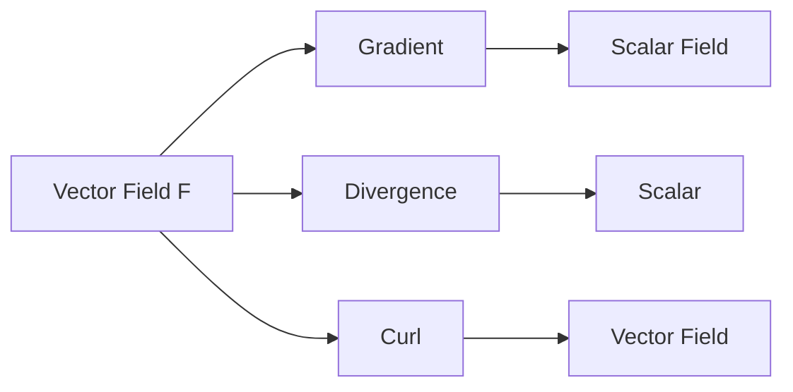

# Creating Graphs in Markdown with LaTeX

This guide covers different methods for creating graphs and visualizations in markdown files.

## Method 1: TikZ/PGF (LaTeX Graphics)

TikZ is a powerful LaTeX package for creating graphics. Works in markdown renderers that support LaTeX (like Obsidian with MathJax, or when exporting to PDF).

### Basic TikZ Example

```latex
\begin{tikzpicture}
  \draw[->] (-3,0) -- (3,0) node[right] {$x$};
  \draw[->] (0,-1) -- (0,3) node[above] {$y$};
  \draw[domain=-2:2, smooth, variable=\x, blue] plot ({\x}, {\x*\x});
  \node at (2,4) {$y = x^2$};
\end{tikzpicture}
```

### Function Plot Example

```latex
\begin{tikzpicture}[scale=0.8]
  \draw[->] (-4,0) -- (4,0) node[right] {$x$};
  \draw[->] (0,-2) -- (0,4) node[above] {$y$};
  \draw[domain=-3:3, smooth, variable=\x, blue, thick] plot ({\x}, {sin(\x r)});
  \draw[domain=-3:3, smooth, variable=\x, red, thick] plot ({\x}, {cos(\x r)});
  \node[blue] at (3,1.5) {$\sin x$};
  \node[red] at (3,0.5) {$\cos x$};
\end{tikzpicture}
```

### Vector Field Visualization

```latex
\begin{tikzpicture}
  \draw[->] (-2,0) -- (2,0) node[right] {$x$};
  \draw[->] (0,-2) -- (0,2) node[above] {$y$};
  \foreach \x in {-1.5,-1,-0.5,0.5,1,1.5}
    \foreach \y in {-1.5,-1,-0.5,0.5,1,1.5}
      \draw[->, blue] (\x,\y) -- ({\x+0.2*\x},{\y+0.2*\y});
\end{tikzpicture}
```

## Method 2: PGFPlots (For Function Plots)

PGFPlots is excellent for plotting mathematical functions.

### Simple Function Plot

```latex
\begin{tikzpicture}
  \begin{axis}[
    axis lines = center,
    xlabel = $x$,
    ylabel = $y$,
    xmin = -3, xmax = 3,
    ymin = -1, ymax = 5
  ]
    \addplot[domain=-2:2, samples=100, blue, thick] {x^2};
    \addplot[domain=-2:2, samples=100, red, thick] {exp(x)};
    \legend{$x^2$, $e^x$}
  \end{axis}
\end{tikzpicture}
```

### Polar Plot Example

```latex
\begin{tikzpicture}
  \begin{polaraxis}[
    width=8cm,
    height=8cm
  ]
    \addplot[domain=0:360, samples=100, blue, thick] {2*cos(2*x)};
  \end{polaraxis}
\end{tikzpicture}
```

## Method 3: Mermaid Diagrams (Alternative)

Many markdown renderers (GitHub, Obsidian, etc.) support Mermaid for diagrams and graphs.

### Graph Theory Graph



### Mathematical Flow Diagram



## Method 4: ASCII Art (Simple Cases)

For simple graphs, ASCII art can work:

```
     y
     |
     |     /\
     |    /  \
     |   /    \
     |  /      \
     | /        \
     |/          \
-----+------------+---- x
    /|            |\
   / |            | \
  /  |            |  \
```

## Method 5: Using Images

For complex graphs, you can:
1. Create the graph in LaTeX/TikZ
2. Export to PDF/PNG
3. Include in markdown: ``

## Recommendations

- **For Obsidian**: TikZ works if you have a plugin, or use Mermaid
- **For GitHub**: Mermaid is natively supported, TikZ requires special setup
- **For PDF export**: TikZ/PGFPlots work perfectly
- **For simple plots**: Consider using external tools and embedding images

## Example: Plotting a Function in Your Notes

Here's a complete example you can use:

```latex
\begin{tikzpicture}[scale=1.2]
  % Axes
  \draw[->] (-3.5,0) -- (3.5,0) node[right] {$x$};
  \draw[->] (0,-1.5) -- (0,3.5) node[above] {$y$};
  
  % Grid (optional)
  \draw[gray, very thin, step=0.5] (-3,-1) grid (3,3);
  
  % Function: y = x^2
  \draw[domain=-2:2, smooth, variable=\x, blue, thick] 
    plot ({\x}, {\x*\x}) node[right] {$y = x^2$};
  
  % Function: y = sin(x)
  \draw[domain=-3:3, smooth, variable=\x, red, thick] 
    plot ({\x}, {sin(\x r)}) node[above right] {$y = \sin x$};
  
  % Labels
  \node at (-0.2,-0.2) {$O$};
  \foreach \x in {-3,-2,-1,1,2,3}
    \draw (\x,0.1) -- (\x,-0.1) node[below] {$\x$};
  \foreach \y in {-1,1,2,3}
    \draw (0.1,\y) -- (-0.1,\y) node[left] {$\y$};
\end{tikzpicture}
```

## Notes

- **TikZ syntax**: Requires `\usepackage{tikz}` in LaTeX (handled automatically in most renderers)
- **Scaling**: Use `[scale=0.8]` or `[scale=1.5]` to adjust size
- **Colors**: Use `blue`, `red`, `green`, etc., or `[color=blue!50]` for transparency
- **Smooth curves**: Use `smooth` option for better curve rendering
- **Domain**: `domain=-2:2` sets the x-range
- **Samples**: More samples = smoother curves (but slower rendering)

